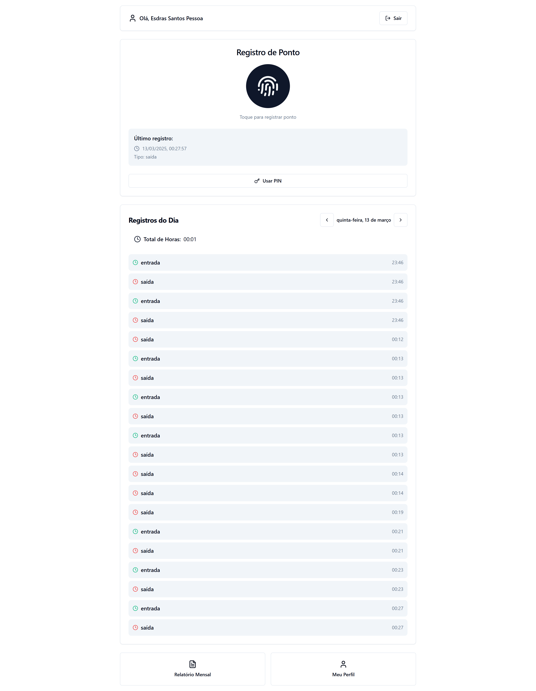

# Ponto Digital

Um sistema moderno de registro de ponto eletrônico para empresas, com interface amigável e múltiplos métodos de autenticação.



## Visão Geral

O Ponto Digital é um sistema completo para gerenciamento de registros de ponto que permite aos funcionários registrarem suas entradas e saídas de forma segura e conveniente. O sistema suporta múltiplos métodos de autenticação (PIN e biometria) e oferece visualizações detalhadas dos registros diários e mensais.

## Funcionalidades

- **Autenticação Segura**: Login e registro de usuários com tokens JWT
- **Registro de Ponto**: 
  - Suporte para autenticação por PIN (código numérico)
  - Suporte para autenticação biométrica (WebAuthn)
- **Visualização de Registros**:
  - Registros do dia atual
  - Navegação entre dias
  - Relatório mensal completo com resumo de horas
- **Estatísticas**:
  - Cálculo automático de horas trabalhadas
  - Visualização de dias trabalhados e atrasos
- **Perfil de Usuário**:
  - Personalização de dados básicos
  - Configuração de PIN para registro de ponto

## Tecnologias Utilizadas

### Backend
- **Linguagem**: Go (Golang)
- **Framework**: Gin (API RESTful)
- **Banco de Dados**: MongoDB
- **Autenticação**: JWT (JSON Web Tokens)
- **Segurança**: Senhas com bcrypt

### Frontend
- **Framework**: React.js
- **Estilização**: Tailwind CSS
- **Roteamento**: React Router
- **Requisições HTTP**: Axios
- **Componentes UI**: Componentes personalizados

## Requisitos do Sistema

- Go 1.16+ (recomendado 1.19+)
- MongoDB 4.4+
- Node.js 14+ (recomendado 16+)
- npm 6+ ou yarn 1.22+

## Instalação e Configuração

### Backend

1. Clone o repositório:
   ```
   git clone https://github.com/seu-usuario/ponto-digital.git
   cd ponto-digital
   ```

2. Configure as variáveis de ambiente criando um arquivo `.env` em `backend/ponto-digital-api/`:
   ```
   MONGO_URI=mongodb://localhost:27017
   DATABASE_NAME=ponto_digital
   ```

3. Instale as dependências e execute o backend:
   ```
   cd backend/ponto-digital-api
   go mod download
   go run cmd/main.go
   ```

### Frontend

1. Navegue até o diretório frontend:
   ```
   cd frontend  # ou cd .. se você estiver no diretório do backend
   ```

2. Instale as dependências:
   ```
   npm install
   # ou
   yarn install
   ```

3. Configure o endereço da API editando os arquivos em `src/services/auth.js` e `src/services/point.js` (se necessário):
   ```javascript
   const API_URL = 'http://localhost:8080/api';  // Ajuste conforme necessário
   ```

4. Execute o frontend:
   ```
   npm run dev
   # ou
   yarn dev
   ```

5. Acesse o aplicativo em `http://localhost:5173` (ou a porta informada no terminal)

## Uso do Sistema

### Cadastro e Login
1. Crie uma conta usando seu nome, email e senha
2. Faça login com seu email e senha

### Configuração de PIN
1. Após o login, acesse **Meu Perfil**
2. Configure um PIN de 4 a 6 dígitos para registro de ponto

### Registro de Ponto
1. Na tela principal, você pode registrar ponto usando:
   - Autenticação biométrica (se disponível no seu dispositivo)
   - PIN numérico
2. O sistema alternará automaticamente entre registros de entrada e saída

### Visualização de Registros
1. Os registros do dia são exibidos na tela principal
2. Use as setas para navegar entre diferentes dias
3. Acesse **Relatório Mensal** para ver um resumo completo do mês

## Estrutura do Projeto

```
ponto-digital/
│
├── backend/
│   └── ponto-digital-api/
│       ├── cmd/                  # Ponto de entrada da aplicação
│       ├── config/               # Configurações e conexão com banco de dados
│       ├── internal/
│       │   ├── handlers/         # Controladores da API
│       │   ├── models/           # Modelos de dados
│       │   └── utils/            # Utilitários (JWT, etc.)
│       └── go.mod                # Dependências Go
│
└── frontend/
    ├── public/                   # Arquivos estáticos
    ├── src/
    │   ├── components/           # Componentes React reutilizáveis
    │   │   ├── ui/               # Componentes básicos de UI
    │   │   └── layout/           # Componentes de layout
    │   ├── pages/                # Páginas da aplicação
    │   ├── services/             # Serviços de API
    │   ├── utils/                # Funções utilitárias
    │   ├── hooks/                # React Hooks personalizados
    │   ├── styles/               # Estilos globais
    │   ├── App.jsx               # Componente principal
    │   └── main.jsx              # Ponto de entrada React
    ├── package.json              # Dependências JavaScript
    └── tailwind.config.cjs       # Configuração do Tailwind CSS
```

## Solução de Problemas

### Problemas Comuns

#### Erro de Conexão com o Backend
- Verifique se o backend está sendo executado
- Confirme se a URL da API no frontend está correta
- Verifique configurações de CORS no backend

#### Problemas com Autenticação
- Certifique-se de que o token JWT está sendo armazenado corretamente
- Limpe o localStorage e tente fazer login novamente

#### Dados de Ponto não Aparecem
- Verifique se a data selecionada está correta
- Confirme se você registrou pontos na data selecionada
- Verifique os logs do console para possíveis erros

### Debug

Para depurar o backend:
```
go run cmd/main.go
```

Para depurar o frontend com logs detalhados:
- Abra o console do navegador (F12)
- Verifique se há erros ou mensagens importantes
- Se necessário, adicione `console.log()` em locais estratégicos do código

## Contribuição

Contribuições são bem-vindas! Sinta-se à vontade para:

1. Fazer fork do projeto
2. Criar uma branch para sua feature (`git checkout -b feature/nova-funcionalidade`)
3. Fazer commit das mudanças (`git commit -m 'Adiciona nova funcionalidade'`)
4. Enviar um push para a branch (`git push origin feature/nova-funcionalidade`)
5. Abrir um Pull Request

## Licença

Este projeto está licenciado sob a [Licença MIT](LICENSE).

## Contato

Se você tiver dúvidas ou sugestões, sinta-se à vontade para abrir uma issue ou entrar em contato através do [esdrassantos41@gmail.com](mailto:esdrassantos41@gmail.com).

---

Desenvolvido com ❤️ por [Bob](https://github.com/developedbyBob)